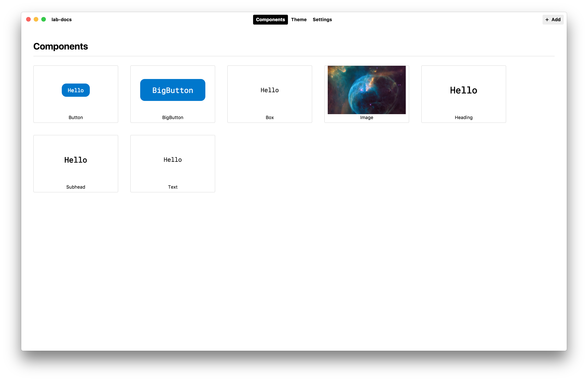
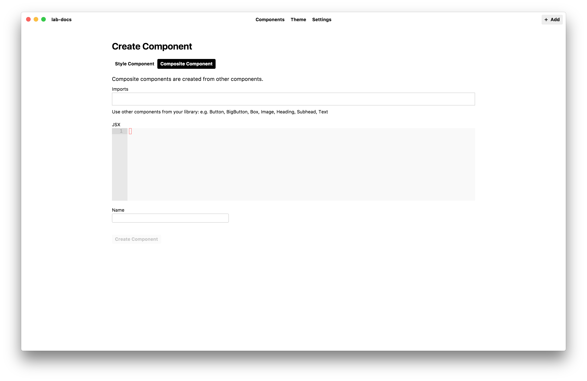
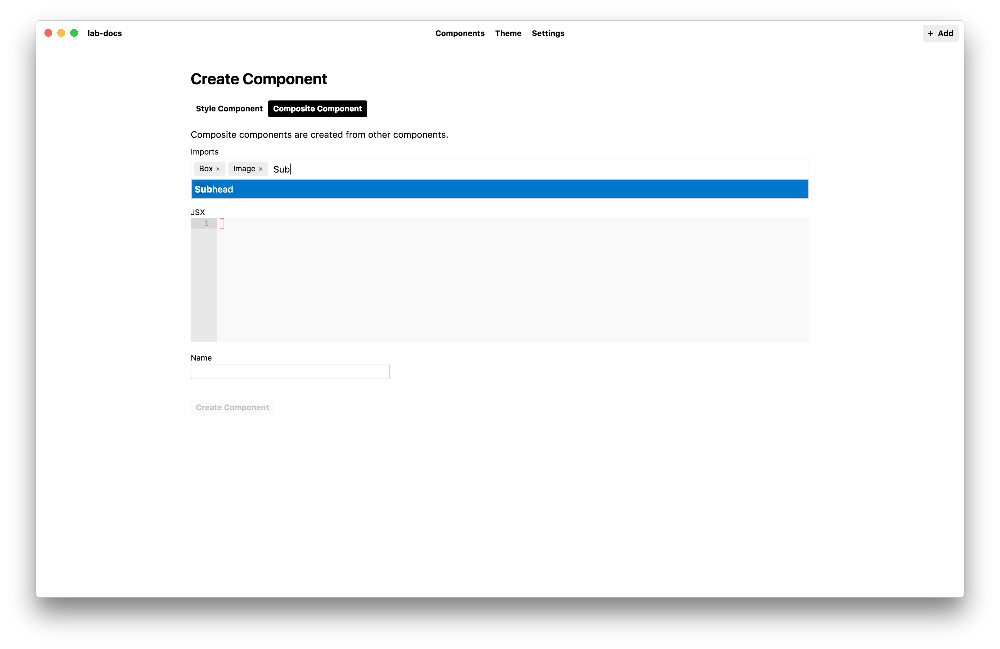
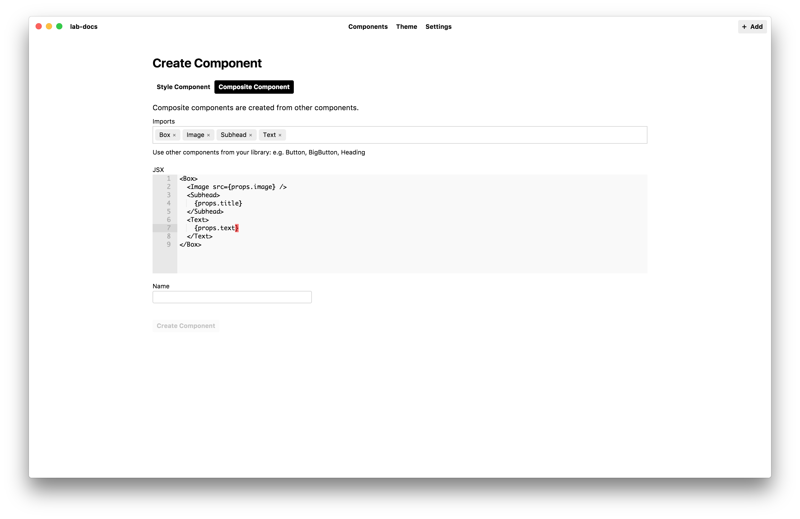
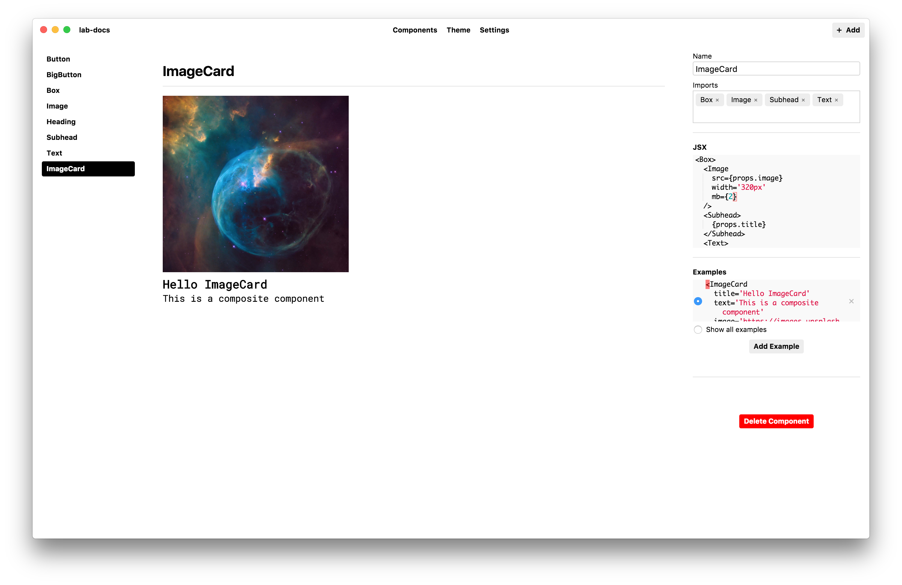

# Composite Components

In addition to creating primitive style components,
Lab can be used to create multi-element composite components
with the other style components in your library.

To create a composite component, click the *Add* button in the upper right,
then click the *Composite Component* tab.

Next, in the *Imports* field start typing the name of the components that
you plan to use for creating the composite component.
A list of available components will appear in the text below the form field.

**Note:** Lab currently only supports creating composite components with primitive style components and extended components;
other composite components cannot be imported.

Then, in the JSX editor, start using the imported components to build a composite component.
To allow the values used in the composite component to be changed dynamically, use [React props][react-props].

Don't worry if the component isn't perfect at this step, you'll be able to edit it in the next step.

Click the *Create Component* button to add the new composite component to your library
and start editing it.
To start, make sure you add an example in the *Examples* editor to give your component some test content.

Since Lab components use [styled-system][system] you can adjust things like margin, padding and font-size for the components
used in your composite component.

- Next: [Importing Components](importing.md)

[system]: https://github.com/jxnblk/styled-system
[react-props]: https://reactjs.org/docs/components-and-props.html
