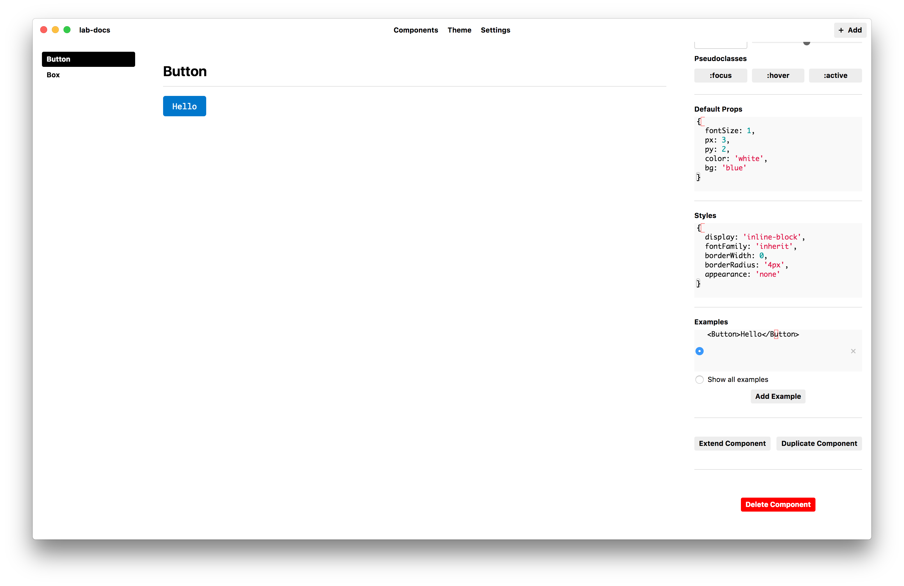
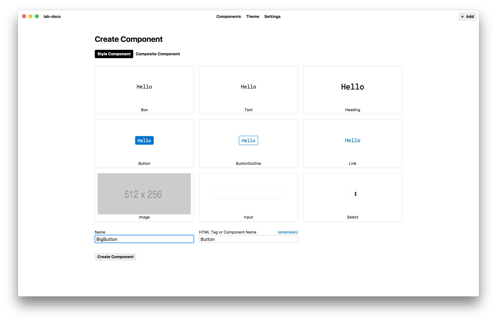
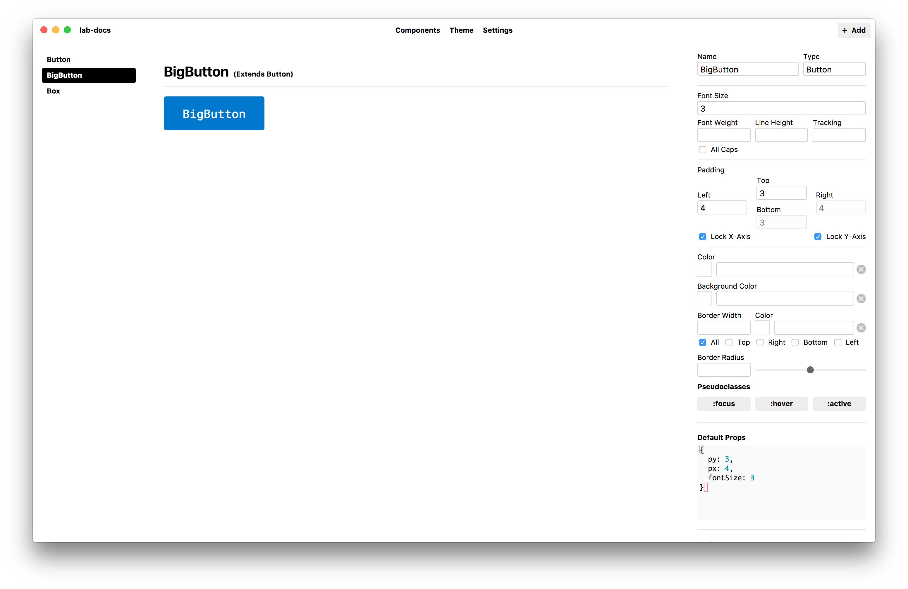
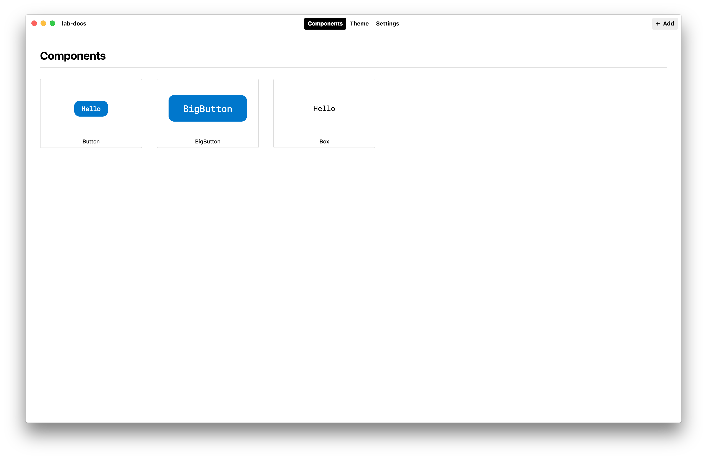

# Extending Components

Primitive style components can be extended when you want to take a component's existing styles and change them slightly. One example would be creating a variation of a `Button` component called `BigButton`.

To extend a component, first click on the base component and then click the _Extend Component_ button in the lower part of the edit panel.

Give your new extended component a unique name and click _Create Component_.

The new extended component will inherit any styles (such as font size and padding) set on its base component, but you can also override any these inherited styles.

Extended components are **linked** to their base component, which means any changes made to the `Button` will be inherited by the extended component. This example shows how the `BigButton` component has inherited adjustments to the `Button` component's `border radius`.

- Next: [Composite Components](composite-components.md)
