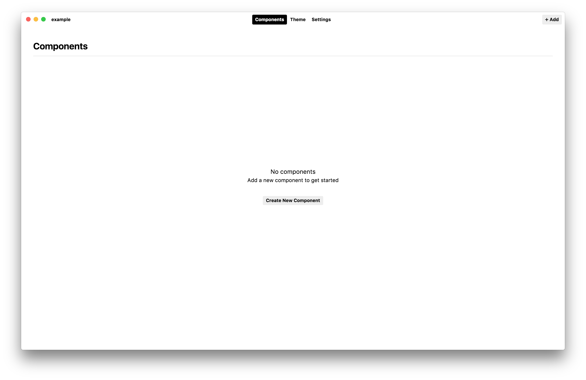
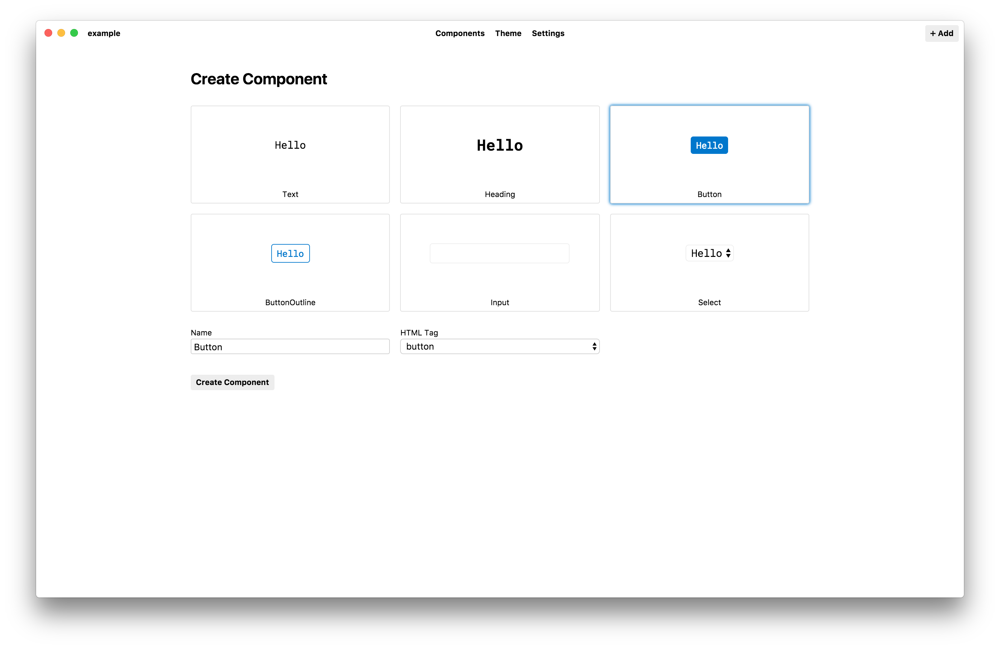
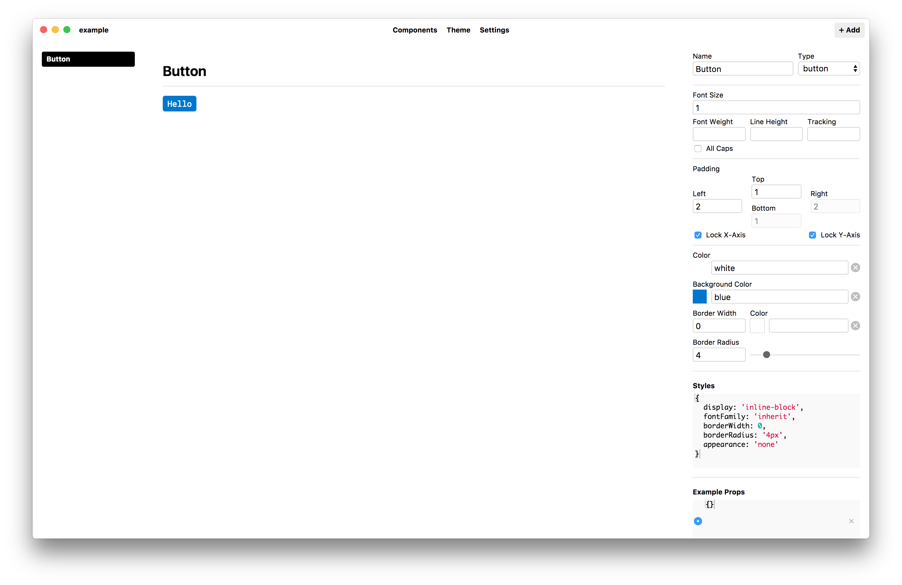
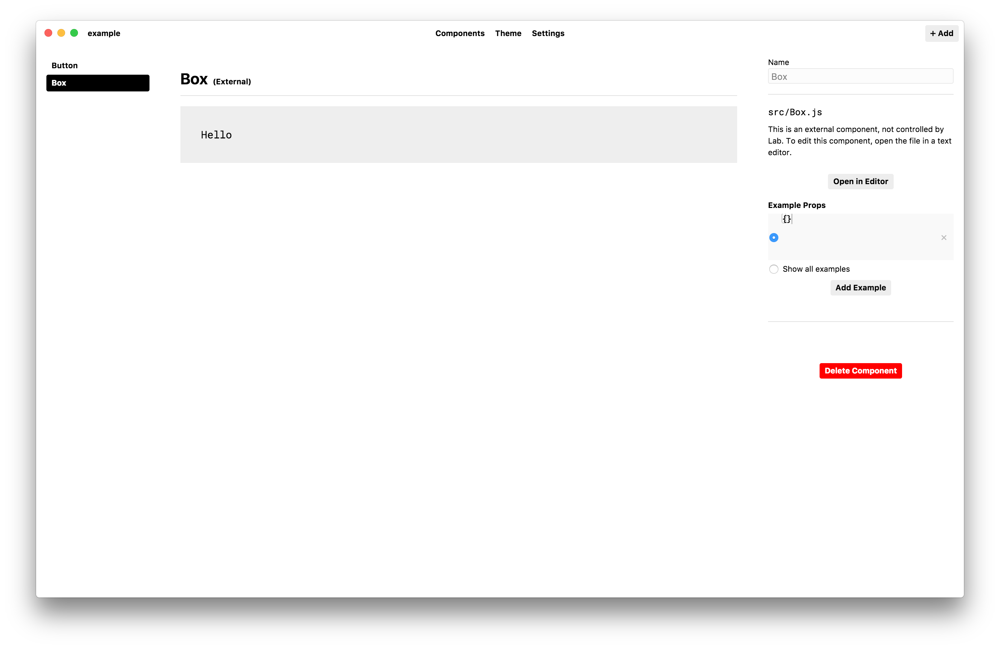

## Getting Started

To get started choose a folder for a new project, where Lab will save a `lab.json` and `theme.json` file.
We recommend you keep this folder under source control, such as git.
Lab will automatically save changes made in the app, and by making use of source control, you‘ll keep a history of changes and make collaborating with others easier.

Once you‘ve got a new project open,
click the *Theme* tab at the top to set global styles for typography, color, and layout.


Lab helps keep your UI visually consistent by following front end development best practices and adhering to constraint-based scales.
This helps keep elements properly aligned and creates a visual rhythm throughout your user interface.


## Components

Next, click on the *Components* tab to view the library of UI components.
You‘ll see an empty screen to start with, so you‘ll need to create some components.



Click the Add button in the upper right to create a new component.
Choose one of the built-in templates to start creating a component.
Give your new component a unique name. We recommend keeping it simple to start with, e.g. Button instead of PrimaryActionButton.



Once you‘ve created the component, you should see a minimally styled version, along with the style panel on the right.

Try adjusting the styles on the right and creating a component that fits in with your visual style.




## Example Props

Once you‘ve got some basic styles set, you‘ll want to test the component out with different states to make sure it works.

React uses *props* to pass values into a component from the parent.
At the bottom of the right panel, you‘ll see a section called *Example Props*.
In the first code editor, try adding the following:

```js
{
  children: 'Hello'
}
```

The syntax here is a plain JavaScript object. This object is passed into the component, similar to adding attributes to an HTML element.

If this were using JSX syntax, it would look like the following:

```jsx
<Button children='hello' />
```

The `children` prop is React‘s way of handling composition.
By passing a string as children into the component, you‘ve set the text inside the component.

Next, below the code editor, click the *Add Example* button.
In the new editor box, add another `children` prop, but this time add a longer string of text.

```js
{
  children: 'Well howdy there partner'
}
```

You can now switch between these two examples to see how your component responds in different situations.


## Customizing Styles

To fine-tune the styles of your component, use the Styles editor.
Using a camelCased JavaScript object syntax, you can change things like
hover states, box shadows, transitions, or any other CSS property.

All CSS properties are camelCased, so instead of `box-shadow`, use `boxShadow` as the key.
All values need to be JavaScript strings, which means they should be enclosed in single quotes.

## Importing Components

React component created outside of Lab can be imported to view them side-by-side and with different example props.

To import a component, select the `File > Import Component` menu item.
Navigate to a component within the same folder as your project to select a component for importing.



Once a component is loaded into your project, you can make changes to the source file in your own text editor,
and changes will be automatically reloaded in Lab.

*Troubleshooting*

- If a component fails to load, the preview should display an error to help with debugging.
- Make sure components are located within the same root folder as your Lab project or in a subdirectory.
- Make sure any npm dependencies have been installed in your project by running `npm install` in your terminal.
- Make sure your component *DOES NOT* make use of any webpack loaders or other build-specific tools.


## Exporting Lab Components

Components created in Lab can be exported as static React components for use in a React application.

Click the `File > Export Library` menu item and select a folder to export your components to. Note that any files that are named the same as a component in your library will be overwritten.

### ThemeProvider

Because Lab components make use of a ThemeProvider component, you will also need to use a ThemeProvider in your own application to use Lab components.

Depending on the CSS-in-JS library you export to, importing a ThemeProvider will look like one of the examples below:

[*styled-components*][sc-theme]

```js
import { ThemeProvider } from 'styled-components'
```

[*glamorous*][g-theme]

```js
import { ThemeProvider } from 'glamorous'
```

[*cxs*][cxs-theme]

```js
import ThemeProvider from 'cxs/ThemeProvider'
```

[*fela*][fela-theme]

```js
import { ThemeProvider } from 'react-fela'
```

[*emotion* & *theming*][emotion-theme]

```js
import { ThemeProvider } from 'theming'
```

The theme created in a Lab project is automatically saved as a JSON file named `theme.json`.
Because it‘s a static JSON file, it can be imported in projects using webpack 2 or higher.

```js
import theme from '../theme.json'
```

At the root of your React application, wrap the entire component tree with the ThemeProvider.

```jsx
const App = props => (
  <ThemeProvider theme={theme}>
    <Main />
  </ThemeProvider>
)
```

[sc-theme]: https://www.styled-components.com/docs/advanced#theming
[g-theme]: https://glamorous.rocks/advanced/#theming
[cxs-theme]: https://github.com/jxnblk/cxs#theming
[fela-theme]: http://fela.js.org/docs/guides/UsageWithReact.html#component-theming
[emotion-theme]: https://github.com/emotion-js/emotion/blob/master/docs/theming.md


## Styled System

Lab components use [styled-system][system] for thematically controlled style props.

[system]: https://github.com/jxnblk/styled-system

