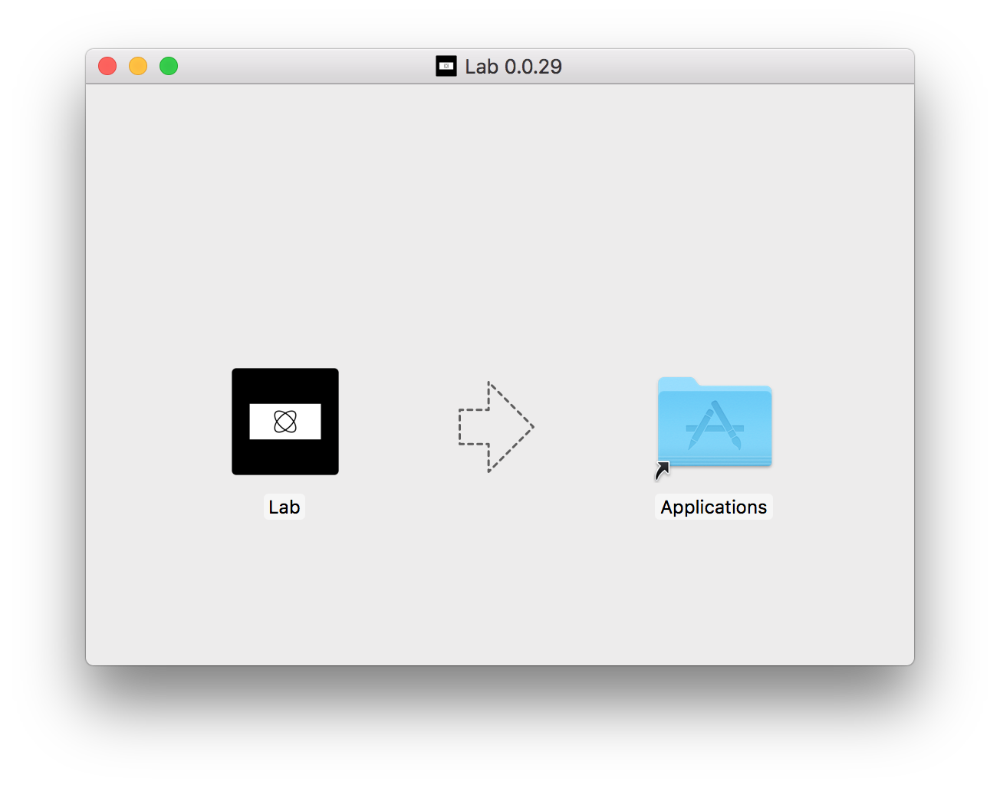
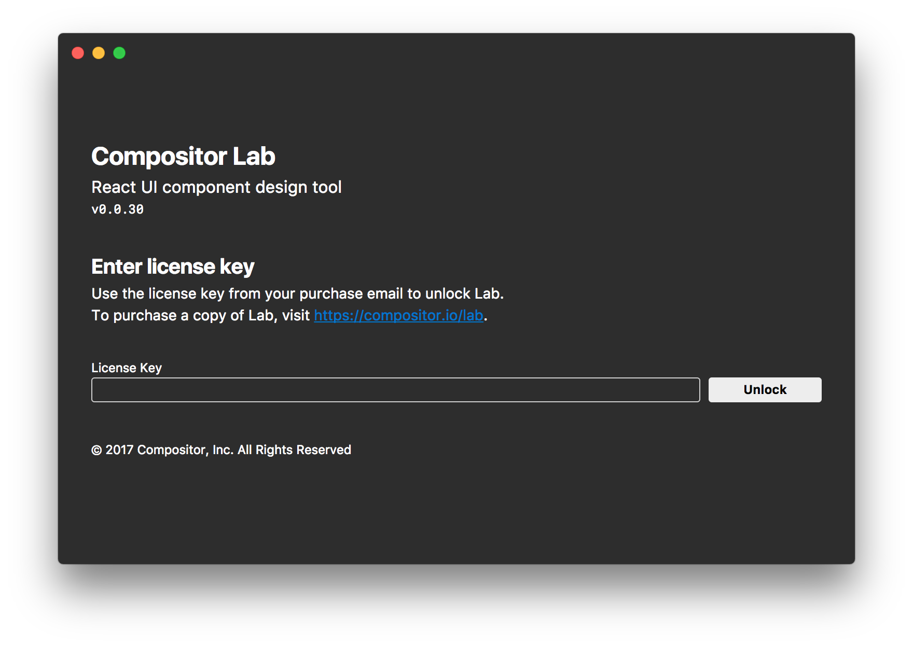

# Installation

[Download the latest][dl] version of the app.

Once it's downloaded, open the `.dmg` file and drag the Lab icon to the Applications folder.

Open the application and enter the license key you received in your purchase email.

Next: [Getting Started][intro]

<!-- todo: update when live -->
[dl]: https://compositor.io/lab
[intro]: getting-started.md
